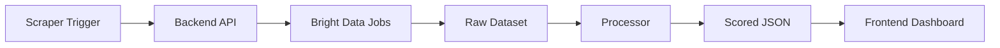

# Architecture

## High-Level Flow

```mermaid
flowchart LR
    A[Scraper Trigger] --> B[Backend API]
    B --> C[Bright Data Jobs]
    C --> D[Raw Dataset]
    D --> E[Processor]
    E --> F[Scored JSON]
    F --> G[Frontend Dashboard]
```

## Backend Endpoints (Initial)
- GET /health
- GET /mock-data

## Response Contract
The frontend expects the payload shape defined in docs/mock_schema.json.
